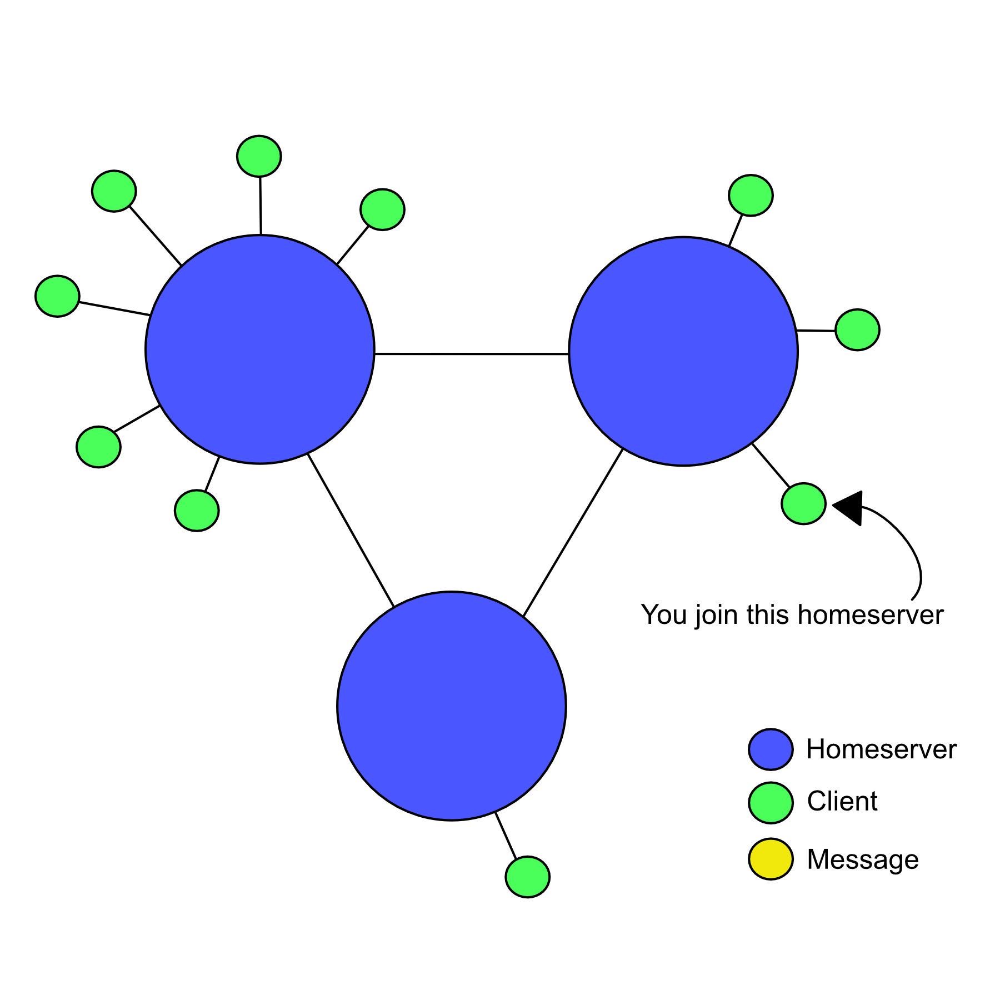
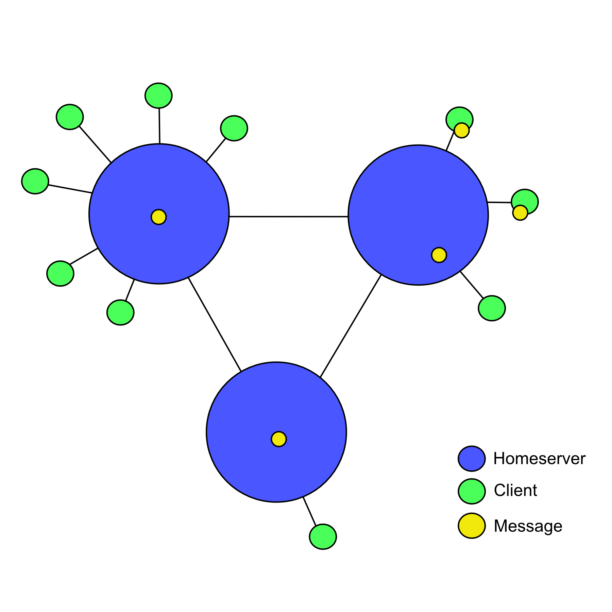

# Dweb: Matrix

## Author info: Full name, photo of yourself, and 1-2 sentence bio

## What is Matrix?

Matrix is an open standard for *interoperable*, *decentralised*, *real-time* communication over IP. It provides a standard HTTP API for publishing and subscribing to real-time data in specified channels, which means it can be used to power Instant Messaging, VoIP/WebRTC signalling, Internet of Things communication, and anything else that could be transmitted over HTTP. The most common use of Matrix today is as an Instant Messaging platform.

* Matrix is *interoperable* in that it can freely communicate with other platforms. Matrix messages are JSON, and easy to parse. Bridges are provided to enable communication with other platforms.
* Matrix is *decentralised* - there is no central server. To communicate on Matrix, you connect your client to a single "homeserver" - this server then communicates with other homeservers. For every room you are in, your homeserver will maintain a copy of the history of that room. This means that no one homeserver is the host or owner of a room if there is more than one homeserver connected to it.

## Why create another messaging platform?

The initial goal is to fix the problem of fragmented IP communications: letting users message and call each other without having to care what app the other user is on - making it as easy as sending an email.

In future, we want to see Matrix used as a generic HTTP messaging and data synchronisation system for the whole web, enabling IoT applications through a single unified, understandable interface.

## What does Matrix provide?

Matrix is an [Open Standard](https://matrix.org/docs/spec), with a specification that describes the interaction of homeservers, clients and Application Services which can extend Matrix.

There are reference implementations of Clients, Servers and SDKs for various programming languages.

## Architecture

You connect to Matrix via a client. Your client connects to a single server - this is your *homeserver*. Your homeserver stores and provides history and account information for the connected user, and room history for rooms that user is a member of.

Homeservers synchronise message history with other homeservers. In this way, your homeserver is responsible for storing the state of rooms and providing message history.

Let's take a look at an example of how this works. Homeservers and clients are connected as in figure 1.

Figure 1. Homeservers with clients


Figure 2.


If we join a homeserver (Figure 3), that means we are connecting our client to an account on that homeserver.

Figure 3.


Now we send a message. This message is sent into a room specified by our client, and  given an event id by the homeserver.

Figure 4.


Our homeserver sends the message event to every homeserver which has a user account belonging to it in the room. It also sends the event to every local client which is in the room. (Figure 5.)

Figure 5.


Finally, the remote homeservers send the message event to their clients which are the the appropriate room.

Figure 6.


## Usage Example - simple chatbot

Let's use the [matrix-js-sdk](https://github.com/matrix-org/matrix-js-sdk) to create a small chatbot, which listens in a room and responds back with an echo.

We first create a `client` instance, this connects our client to our homeserver:

```javascript
const client = sdk.createClient({
    baseUrl: "https://matrix.org",
    accessToken: "....MDAxM2lkZW50aWZpZXIga2V5CjAwMTBjaWQgZ2Vu....",
    userId: "@USERID:matrix.org"
});
```

Next we perform a first sync, to get the latest state from the homeserver:

```javascript
client.once('sync', function(state, prevState, res) {
    console.log(state); // state will be 'PREPARED' when the client is ready to use
});
```

We listen to events from the rooms we are subscribed to:

```javascript
client.on("Room.timeline", function(event, room, toStartOfTimeline) {
    handleEvent(event);
});
```

Finally, we respond to the events by echoing back messages starting "!"

```javascript
function handleEvent(event) {
    // we know we only want to respond to messages
    if (event.getType() !== "m.room.message") {
        return;
    }

    // we are only interested in messages which start with "!"
    if (event.getContent().body[0] === '!') {
        // create an object with everything after the "!"
        var content = {
            "body": event.getContent().body.substring(1),
            "msgtype": "m.notice"
        };
        // send the message back to the room it came from
        client.sendEvent(event.getRoomId(), "m.room.message", content, "", (err, res) => {
            console.log(err);
        });
    }
}
```

## Learn More

The best place to come and find out more about Matrix is on Matrix itself! The absolute quickest way to participate in Matrix is to use Riot, a popular web-based client. Head to <https://riot.im/app>, sign up for an account and join the [`#matrix:matrix.org`](https://matrix.to/#/#matrix:matrix.org) room to introduce yourself.

[matrix.org](https://matrix.org) has many resources, including the [FAQ](https://matrix.org/docs/guides/faq) and [Guides](https://matrix.org/docs/guides/) sections.

Finally, to get stuck straight into the code, take a look at the [Matrix Spec](https://matrix.org/docs/spec/), or get involved with the many [Open-Source projects](https://github.com/matrix-org).