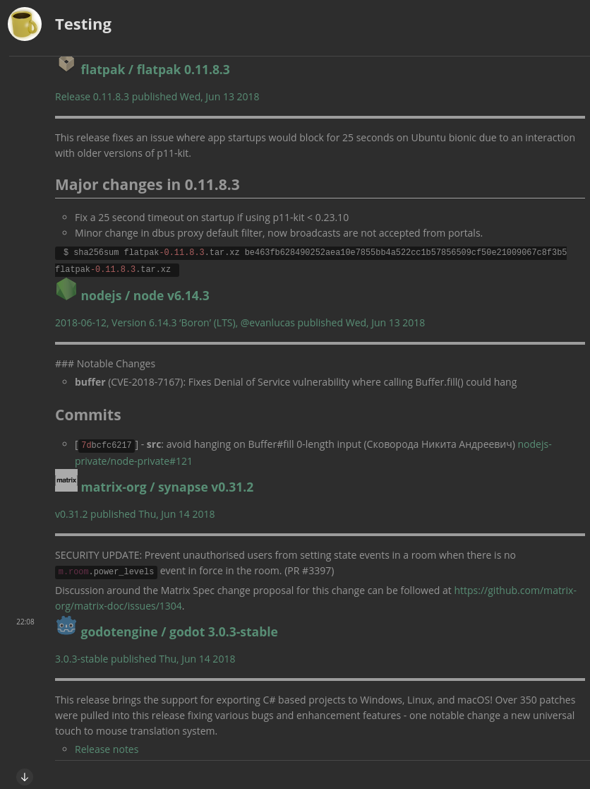

## [&Adam]: TWIM I learned that matrix is being used as an experimental transport for the Raiden network. Maybe this was already well known, but I thought it was interesting.

<https://github.com/matrix-org/matrix-python-sdk/pull/236#discussion_r195832459>

## [kitsune] q projects

> TWIM: [libQMatrixClient] 0.3.0.2 has been released - no new features, just small fixes including one for an unlucky typo preventing 0.3.0.1 from generating .cpp files with [GTAD].

> [Quaternion] 0.0.9.2 is out, another step towards 0.1. Aside from bugfixes and using the latest libQMatrixClient, it features an entirely new timeline layout similar to that of Riot (the old one is still around too). Also, you can now change some settings through the menu rather than by editing a configuration file or registry - including switching timeline layouts on the fly!

## [Ananace]

> Decided to actually start pushing code I've been slowly prodding at for the last while, ever since starting the Ruby Matrix SDK in fact.
> Working on a Sibbell like system that tracks new releases on GitHub projects, posting them into a specified Matrix room.
> https://github.com/ananace/matrix-releasetracker if you want to try it yourself, though it's just a bunch of prototyping code at the moment

## Plasma

<https://gitlab.com/beerfactory.org/plasma/tree/master>
https://matrix.to/#/#plasma:beerfactory.org

## Travis terraform

https://matrix.to/#/#terraform-provider-matrix:t2bot.io