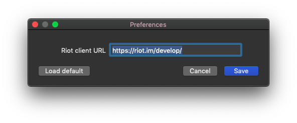

# This Week in Matrix 2019-03-01

## matrix-puppet-bridge

[tom]:

[matrix-puppet-bridge v1.17.0](https://github.com/matrix-hacks/matrix-puppet-bridge/releases) has been released!

> This release:
> 
> - Handles m.notice messages sent from Matrix as text, instead of ignoring them (thanks go to https://matrix.to/#/@cdknight1:matrix.org !)
> - Sets rooms invite-only when they're touched, instead of relying on others not knowing the room ID (thanks to https://matrix.to/#/@AndrewJDR:matrix.org , from all of us who federate on the homeservers we use to bridge!)
> 
> Matrix rooms representing remote rooms being joinable by anyone who knows the room ID (which is generated, at least in part, from the remote room ID in all the matrix-puppet-bridge applications) was a big deficiency, and it's finally resolved. It wasn't known whether or not we could do this, and have our ghost users still be able to join the rooms (they need to be invited instead of just joining themselves), until it was attempted and tested in a few of the bridge applications.
> 
> Because it _is_ a big deal, new minor versions of [matrix-puppet-slack](https://github.com/matrix-hacks/matrix-puppet-slack/releases), [matrix-puppet-facebook](https://github.com/matrix-hacks/matrix-puppet-facebook/releases), [matrix-puppet-hangouts](https://github.com/matrix-hacks/matrix-puppet-hangouts/releases), [matrix-puppet-signal](https://github.com/matrix-hacks/matrix-puppet-signal), [matrix-puppet-imessage](https://github.com/matrix-hacks/matrix-puppet-imessage) and [matrix-puppet-groupme](https://github.com/matrix-hacks/matrix-puppet-groupme/releases/tag/v1.1.0), bumping the matrix-puppet-bridge version to 1.17.0, have been released.

## matrix-media-repo

[TravisR] reports that:

> [matrix-media-repo] has alpha-quality support for s3 (and s3-like services) on the travis/s3 branch. Intrepid testers are encouraged to give it a shot, and report bugs. Caution: may upload your cat.

## Quaternion

[kitsune]:

> [Quaternion] (master branch, and upcoming v0.0.9.4) can now open rooms by their aliases or ids upon pressing Ctrl+O, as long as those rooms are already in your room list (opening arbitrary public rooms will come in later versions). You can even paste matrix.to URIs for users (will open direct chat) and rooms in the same dialog. Navigation to known rooms inside Quaternion also works.
>
> libQMatrixClient 0.5 is release candidate now. Client authors are welcome to upgrade and try it.

## Scylla

It's been a little while since we saw any news about [Scylla], a web-based client written in Elm. [VaNilLa] said:

> Scylla, the Elm-based Matrix client, has received a few improvements. Included in this update: Files that are uploaded now keep their original name (as opposed to being called File) Sent messages are displayed right away, instead of when they are delivered to the server Usernames are only shown once per several consecutive messages, to avoid clutter Some CSS changes have been made to keep the interface looking clean  
> Almost forgot! You can find [Scylla's source code here][Scylla] and a [live instance here](http://scylla.danilafe.com/)!

## weechat-matrix

Matthew has been spending time getting back into WeeChat:

> weechat-matrix's e2e support is really impressive (via matrix-nio and python-olm). It can only read rather than send right now, but otherwise looks to be massively on the right track. It even does fingerprint-based verification!

## Riotic: new fork with updates

[Aaron Raimist] has made some updates to Riotic, which was a good chance for me to revisit it. It works nicely and is a great alternative to the Electron version of Riot. I also like being able to use <https://riot.im/develop> as an app.

> I've slightly tweaked Joakim Ahlen's Riot wrapper for macOS, riotic, which uses the native WKWebView instead of Electron. I updated the app to be sandboxed so it has very limited access to your system. I also updated the interface to follow macOS conventions and updated it to use the latest version of Swift.
>
> riotic does have some limitations though. Riot doesn't support VoIP on Safari so riotic can't support VoIP either and WKWebView doesn't support notifications as far as I can tell. Right now it uses a really old Riot icon, maybe I'll ask about using one of these community made icons <https://github.com/vector-im/riot-web/pull/4474>.
>
> It does have some advantages over the official Riot Electron app though. The app is only ~12 MB compared to Riot which is ~180 MB, it also uses significantly less RAM. riotic also allows you to pick what Riot URL to use so you can run /develop as a desktop app.
>
> You can download riotic from <https://github.com/aaronraimist/riotic/releases/tag/v1.1>.

## synapse-netcore-workers

[Half-Shot] has been working on [synapse-netcore-workers]:

> The synapse-netcore-worker project has continued to evolve. You can now federate with other servers using the federation sender implementation. It supports everything except device lists at the moment, so it supports PDUs/EDUs and can just be connected up to one of your existing synapse instances. It's not been battletested enough yet to be put in production (hence no dockerfile), but it's very fast.  
> Oh and for those of you who don't know "synapse-netcore-worker" is Travis's .NET implementation of synapse workers, room can be found [#synapse-netcore-workers:t2bot.io].

If you're as uninitiated as I was three days ago, this project is a replacable worker component for Synapse, which just happens to be written in .net.

## New Rooms

[Aaron Raimist] has created a new room for Formula 1 fans:

> Now that the Formula 1 season is getting underway it's probably a good time to announce @CIA:matrix.org's new(ish) room: [#f1:matrix.org]
> When this blog post is released there will be 16 days left before the first race of the 2019 season  
> There was previously a Formula 1 room but it was merged with Snoonet's IRC channel which tends to be extremely busy. This is a matrix only room.

[VaNilLa]: https://matrix.to/#/@daniel:riot.danilafe.com
[Scylla]: https://github.com/DanilaFe/Scylla
[kitsune]: https://matrix.to/#/@kitsune:matrix.org
[Quaternion]: https://github.com/QMatrixClient/Quaternion
[tom]: https://matrix.to/#/@root:thomasprofitt.com
[#f1:matrix.org]: https://matrix.to/#/#f1:matrix.org
[Aaron Raimist]: https://matrix.to/#/@aaron:raim.ist
[synapse-netcore-workers]: https://github.com/turt2live/synapse-netcore-workers
[#synapse-netcore-workers:t2bot.io]: https://matrix.to/#/#synapse-netcore-workers:t2bot.io
[Half-Shot]:  https://matrix.to/#/@Half-Shot:half-shot.uk
[matrix-media-repo]: https://github.com/turt2live/matrix-media-repo
[TravisR]:  https://github.com/turt2live