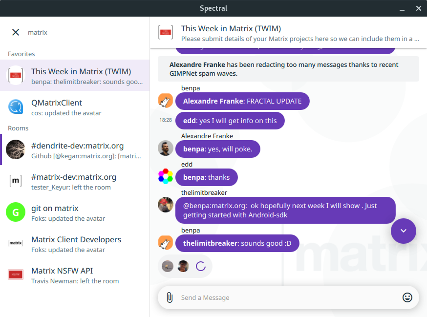
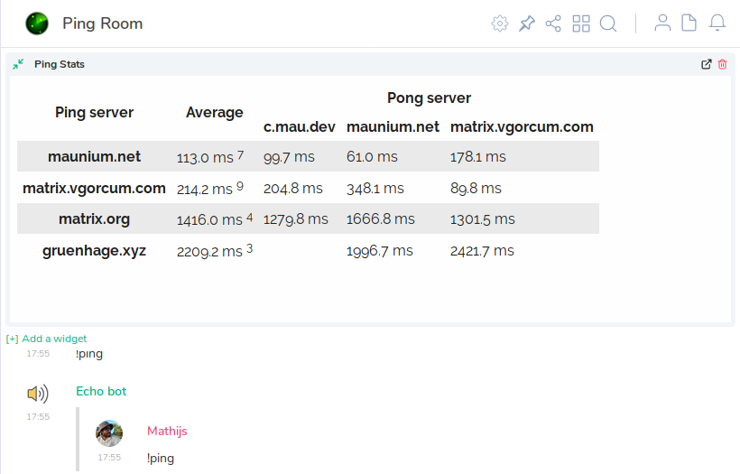

# This Week in Matrix 2019-03-08

## Synapse and the great need to have your own certs

From Neil of the Synapse-team

> Folks, in the run up to Synapse 1.0, if you are running your own homeserver now would be an excellent time to check that your TLS certificates are up to date. Point you server name at <https://matrix.org/federationtester/> and if there are errors check our handy FAQ on how to fix it. If you do not have valid TLS certificates Synapse 1.0 will refuse to federate with you.

> [benpa] has put together a federation checker to quantify how many homeservers are 1.0 ready - <https://www.arewereadyyet.com/> - It currently stands at 50.5% let’s try and get that to 60% over the weekend.

> Aside from all that, the team have been working on preparing for Synapse 1.0, you can [track our progress here](https://github.com/orgs/matrix-org/projects/8). We promise not to just land 1.0 out of the blue - we’ll give everyone a 2 week warning to give an stragglers a chance to get their certificates in order.

And this week we have Neil and Erik talking about this in more detail on Matrix Live

<iframe width="560" height="315" src="https://www.youtube.com/embed/dPvis1eEMDM" frameborder="0" allow="accelerometer; autoplay; encrypted-media; gyroscope; picture-in-picture" allowfullscreen></iframe>

## JeonServer and related project updates

[ma1uta] has been working on [Jeon] - Java interfaces to the various [Matrix APIs][Matrix Spec], and is now getting ready to start work on a homeserver. He was previously asking for a name for this project, but might now have settled on "**JeonServer**".

> First Release Candidate of the [Jeon] Project with upcoming Client-Server API 0.5, Server-Server API 0.1.1, Application API 0.1, Identity API 0.2 and Push API 0.1.  
> Also the RC of the [jmsdk] has been prepared with Java Matrix Client for Client-Server API 0.5.  
> Changes in the C2S: Added the `m.push_rules` event, removed presence list methods and other minor fixes.  
> Added S2S API of the 0.1.1 version.  
> I prepared a very simple page <https://ma1uta.github.io/> with links to the swagger schemas (json and yaml) for all Matrix API which generated from the Jeon code.

Chat more in [#jeon:matrix.org] or [#jeon:ru-matrix.org].

## Construct updates

> There's a lot of progress, a few endpoints and features have been implemented this week such as Room Tags and all of the spec features for /createRoom. Most of the progress has been with testing and bugfixes thanks to Yan Minari, and [tulir] and mujx.  
> We've fixed several interactions with synapse such as invite accept/deny and synapse's ability to join and leave construct created rooms without any issues.
> Lastly and most important, we've generated an official issues list thanks again to our star tester Yan Minari available here <https://github.com/matrix-construct/construct/issues>

For more new Construct news watch the [repo](https://github.com/matrix-construct/construct/) or join [#zemos-test:matrix.org]

## OpenSAPS: Open Slack API Server

[pztrn] has created a new mechanism for relaying apps that use Slack webhooks into Matrix:

> To everyone who wonders how to connect his application to Matrix (at least for notifications of some kind) - use [OpenSAPS]! It just reaches v0.1.0.
> [OpenSAPS] stands for Open Slack API Server and able to retransmit messages from applications (like Gitlab or everything that can send data to Slack) to somewhere else. Right now these "somewhere else" is a Telegram (with HTTP proxy support) and Matrix! Written in Golang to ensure minimal memory footprint. Take a look at <https://gitlab.com/pztrn/opensaps>  
> Tested with Gitlab and Gitea but should work with almost any service.  
> Join [#opensaps:pztrn.name] to talk with developers or get help. BTW, there is OpenSAPS instance in our room that transmits everything from gitlab.com into room!

> (almost) immediately after 0.1.0 comes [0.1.1](https://gitlab.com/pztrn/opensaps/tags/v0.1.1), with fixed URLs parsing and fixed inability to login into servers which use .well-known for delegation.

> It should work \[with other webhooks\]. If something strange happens there is also a possibility to write own parser to make everything work 🙂 Tested with Gitlab and Gitea ATM. Share application names that work, I'll start to make a list of them. :D

## matrix-puppet bridges: matrix-puppet-slack and matrix-puppet-hangouts updates

[tom] reports from [#matrix-puppet-bridge:matrix.org]:

> * [matrix-puppet-slack](https://github.com/matrix-hacks/matrix-puppet-slack/releases) 1.12.0 has been released. This version:
>   * Fixes incorrect room alias reserved prefixes (thanks to jeffcasavant!)
>   * Handles a new kind of Slack event (hence the minor version bump): channel renames (thanks to [d3m3vilurr] !)
> * [matrix-puppet-hangouts](https://github.com/matrix-hacks/matrix-puppet-hangouts/releases) 1.0.1 has been released.
>   * The patch fixes node 8 compatibility broken by a recent change.
> * Work is ongoing to [replace unwieldy Promise chains in matrix-puppet-bridge with async/await](https://github.com/matrix-hacks/matrix-puppet-bridge/pull/49), to make the lives of maintainers & contributors easier.

## MiniVector update

[bubu] let us know about MiniVector updates

> [Minivector], a minimalistic fork of riot-android had a new release last week, getting rid of a few more unused dependencies. This brings the final apk size down to 13mb vs riot android's 25mb. This work was done by [@hrjet:matrix.org]. The project room is here: [#miniVectorAndroid:matrix.org]

## matrix-docker-ansible-deploy, now with Discord and email templates

The volume of discussion about installing/configuring Synapse and other Matrix-related components is like a subculture in itself. Standing tall within this is [Slavi]'s [matrix-docker-ansible-deploy] collection of Ansible playbooks. They're a great way to quickly and reliably get a Synapse instance running.

> Thanks to [Lionstiger](@lionstiger:divisibleprimes.com), [matrix-docker-ansible-deploy](https://github.com/spantaleev/matrix-docker-ansible-deploy) now supports [Discord](https://discordapp.com/) bridging via [matrix-appservice-discord](https://github.com/Half-Shot/matrix-appservice-discord).  
> Those wishing to give it a try can refer to the [Setting up Appservice Discord bridging](https://github.com/spantaleev/matrix-docker-ansible-deploy/blob/master/docs/configuring-playbook-bridge-appservice-discord.md) documentation page.

> Thanks to [Sylvia van Os](https://github.com/TheLastProject), [matrix-docker-ansible-deploy](https://github.com/spantaleev/matrix-docker-ansible-deploy) now has the [Ability to customize mxisd's email templates](https://github.com/spantaleev/matrix-docker-ansible-deploy/blob/master/CHANGELOG.md#ability-to-customize-mxisds-email-templates)

## Quaternion 0.0.9.4 beta

[kitsune]:

> between chasing bugs in [Quaternion 0.0.9.4 beta](https://github.com/QMatrixClient/Quaternion/releases/tag/0.0.9.4-beta1) (translators, your help is hugely needed to catch up with new and updated strings) there happens almost literal bikeshedding in [#qmatrixclient:matrix.org], under an excuse of discussing The Universal Algorithm to Colour Usernames. Join the fun!

## Bifrost bridge gatewaying

[Half-Shot]:

> Bifrost is now starting to comfortably support gatewaying. For those that don't know, gateways allow a remote user to participate in the matrix network without prior bridging, it's very fancy. The latest changes are that XMPP clients can now ask for the public room list by querying the bridge component. There is [a video on this](https://matrix.half-shot.uk/_matrix/media/v1/download/half-shot.uk/c0c72e55e6e1ca8c52e4e7f1a627a1d9) using the Yaxim XMPP client on Android (Credit to Ge0rG). Come chat with us in [#bifrost:half-shot.uk]

You can check out a video of the bridge in operation here: <https://georg.lukas.pro/galleries/XMPP/yaxim-matrix.mp4>.

## Spectral development restart

[Black Hat]:

> [Spectral] development now continues after a short break. The new "material design" has been merged into master, along with a few bug fixes. I plan to work on Kirigami port in the following two weeks.

## Possible project to implement Synapse workers in Rust

I am also looking into the "worker" feature of Synapse and am trying to write a group of workers as an excuse to learn Rust.

## Fractal

[Alexandre Franke] reports on Fractal:

> Since our last update about Fractal we [landed typing notifications](https://gitlab.gnome.org/GNOME/fractal/merge_requests/262), found out [we actually weren’t logging anything](https://gitlab.gnome.org/GNOME/fractal/issues/430), [recovered the ability to log](https://gitlab.gnome.org/GNOME/fractal/merge_requests/369), and [restored spellcheck support](https://gitlab.gnome.org/GNOME/fractal/merge_requests/377).  
> We are also now [tagging uploaded audio files as such](https://gitlab.gnome.org/GNOME/fractal/merge_requests/322) and [adding thumbnails to image files](https://gitlab.gnome.org/GNOME/fractal/merge_requests/365), courtesy of our Outreachy intern, and we fixed a bunch of other things.

## #ping:maunium.net

[tulir] making crazy [maubot]s this week:

> I made a room for `!ping`ing [echo](https://github.com/maubot/echo) maubots: [#ping:maunium.net]. The room has a bunch of echo bots, currently on maunium.net, c.mau.dev and matrix.vgorcum.com. It also has a new maubot plugin called [pingstat](https://github.com/maubot/pingstat), which collects the pong data and makes a leaderboard website. The website is linked to the room as a widget.

Check out instructions to get your own maubots setup here: <https://github.com/maubot/maubot/wiki/Setup>

## synapse-netcore-workers

[Half-Shot]:

> Not much news to report on the [netcore-workers](https://github.com/turt2live/synapse-netcore-workers) other than it's maturing and we have nice things now like logging, metrics and a docker image you can run at home. I'm running the federation sender fulltime on half-shot.uk to *dogfood* it and will announce when I think it's good for general consumption :)

Related: [Black Hat] is investigating a similar project in Rust. Anyone interested in that please do go chat.

## matrix-wug, IPA rendering bot, gets support for cherokee

[Dandellion] on [matrix-wug]:

> This is "script" or written language has a very interesting story behind it, where the creator of it actually couldn't read and write. Regardless, he wanted to write down his language, and developed his own writing system.  
> The characters look a lot like latin characters because he tried to imitate the characters of a bible. Just a fun history lesson!

## weechat-matrix

[Paul](@ptman:matrix.org) created a dockerfile to install [weechat-matrix]:

> since [weechat-matrix] is a bit involved to install, I create a dockerfile that takes care of it: <https://github.com/poljar/weechat-matrix/pull/60> . And people allergic to docker can look inside to check the steps (just reading the readme doesn't give a full picture)

## modular.im

Modular.im is a Matrix-as-a-SaaS offering. It's suitable for users who want the benefits of having their own Matrix server but to not need to host and run one.

There are some new announcements this week:

> Today we are pleased to announce that you can now [customise your Modular hosted Riot](https://www.modular.im/custom-branding) at the touch of a button, through the Modular host admin interface. Better yet, this is available to all Modular customers at no additional cost.

> Today we are [launching a proof of concept for purchasing additional content](https://www.modular.im/stickers) via the Modular integration manager.  
> For the initial experiment we're offering a set of "snazzy", limited edition Matrix stickers for the princely sum of $0.50. These are digital versions of the Matrix and Riot hexagons that some of you may have seen in real life.

## Still more!

[decred.org](https://decred.org) are an organisation concerned with blockchain technology, and they also use Matrix for their communications! They now have a stickerpack available in Riot, so if you'd like to use their stickers you can add the pack and get going with blockchain-related memes.

If **you** have a stickerpack you'd like to see included, please [let me know][benpa].

Celebrating the creation of a new homeserver instance at kde.org, [Jonathan Riddell has written an article](https://jriddell.org/2019/02/28/kde-chat-on-matrix/).

[sortebill](https://matrix.to/#/@sortebill:matrix.org) created [#drums:matrix.org](https://matrix.to/#/#drums:matrix.org):

> I've made a room for anyone interested in drums and percussion. Acoustic, Electronic, Played or Programmed, anything goes as long as it's rhytm related. The room is focused on both playing/programming drums and equipment.

There was a somewhat longstanding bug that affected a number of users: often manifesting as unexpected and frustrating "Unable to decrypt" messages - this has now been fixed, take a look at <https://github.com/vector-im/riot-web/issues/6838>

## They think it's all over...

It is now! If you'd like to have your project included in this post, come chat to us in [#twim:matrix.org]!