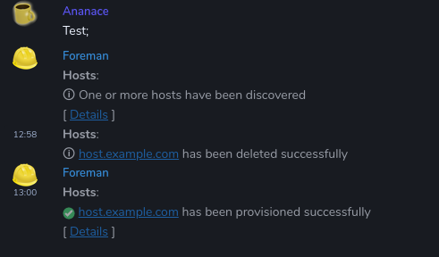

# This Week in Matrix 2019-03-15

## Matrix Live S3E17: Hello Ryan

This week you're stuck with me, but I'm chatting to Ryan, who works on Riot web, and having previously worked at Mozilla has a LOT of interesting things to say about Firefox, the browser market, the importance of decentralisation, Matrix being GREAT and more.

<iframe width="560" height="315" src="https://www.youtube.com/embed/2LiaUmNdT0s" frameborder="0" allow="accelerometer; autoplay; encrypted-media; gyroscope; picture-in-picture" allowfullscreen></iframe>

## arewereadyyet.com

<https://arewereadyyet.com> is not just an amazing domain we somehow managed to buy, it's also the first place to look for progress towards full Matrix 1.0 readiness. Read more details at <https://matrix.org/blog/2019/03/15/matrix-1-0-https-arewereadyyet-com/>.

## Spec

> Lots of activity but most notably MSC 1915 (a blocker for Matrix 1.0) is making progress.https://github.com/matrix-org/matrix-doc/pull/1915

## Synapse . . . 1.0?

> It's all about 1.0 for the Synapse gang this week. This means performance improvements across the board in the form of read receipt batching, user directory (room directory coming soon!) and rate limiting on log in and registration APIs.

> Brendan shipped the low bandwidth CoAP proxy we demod at FOSDEM

> As well as a bunch of spec implementation projects to ensure that Synapse (and Sydent) are ready for Synapse 1.0.

## Synapse workers projects

Turn-of-phrase of the week from [Half-Shot] ("make it more performant and less crashy"):

> [synapse-netcore-workers] is progressing as strongly as ever. This week has mainly been supporting a couple of users trying to use the fed sender, and also trying to make it more performant and less crashy. I've been using it solidly for two weeks now, and by and large it's been working nicely :)

[Black Hat] has been working on [Cortex], a similar project in Rust:

> Support for replication protocol in [Cortex] is mostly complete. A federation sender worker implementation is being worked on. If anyone is interested or wants to contribute, please go to [#cortex:encom.eu.org]

## Construct

> Lots of progress this week. I'd like to give a special thanks to Yan Minari for another great week of testing, bugfixes and feature requests.
>
> * We implemented features related to room directory lists, reporting content, ignoring users, VoIP turnServer, prev_content in state events.
> * Improving SSL: allowing configurable lists of ciphers, and sending/receiving SNI.
> * At the lower level: adding support for Linux AIO features that are present in newer kernels, giving a nice performance boost.

For more new Construct news watch the [repo](https://github.com/matrix-construct/construct/) or join [#zemos-test:matrix.org]

## New Client for Android: Pattle

[Wilko] announced [Pattle], a Matrix client for Android:

> Hey all, I've been working on my Matrix Android app, Pattle! The goal of Pattle is to be an easy to use app for Matrix, with it's design inspired by popular apps such as WhatsApp and Telegram. [Development happens here](https://git.pattle.im/pattle/android), and contributions are encouraged! The app is not currently suited for daily use, but some functionality is there, such as registering, logging in and viewing chats.  
> Currently it's an Android only app using the official Matrix Android SDK, but the plan is to support iOS and web too, in the future.  
> There's also a sort of [design document](https://docs.pattle.im/design/philosophy/) available, stating how Pattle differs from standard Matrix apps and what it's goals are. The intent of the design document is to make development easier later on for other platforms

* Get APKs to test: <https://git.pattle.im/pattle/android/-/jobs/428/artifacts/browse/app/build/outputs/apk/debug/>
* and join the development room: [#pattle:matrix.org]

## Quaternion 0.0.9.4 beta 2 available

[kitsune]:

> [Quaternion] 0.0.9.4 beta 2 (too many numbers? That too shall pass) is out, with bugfixes and translation updates. Notably, Quaternion won't crash on upgraded rooms in some cases, and won't cry in [#gsoc:matrix.org] and other v3 rooms. Translators are still strongly encouraged to push forward - due to all the features and fixes, there are many untranslated strings across the board! Also, some bugfixes are [still in order](https://github.com/QMatrixClient/Quaternion/projects/2#column-4040192) before we can call the release RC, and some of them are really easy - so if you'd like to contribute, it's a great time to start!

## Riot Web

> * Preparing for 1.0.4 release with lots of small polish fixes
> * Planning our roadmap for the next few quarters

## Riot iOS

> iOS released 2 times. Last release was to fix an issue with invalid scalar token.  
> Review of one PR from the community for iOS10 notifications.  
> Started implementing device verification with emoji.

## Riot Android

> We've released v0.8.25 on Thursday, containing refresh of invalid scalar token, and some bugfixes. Links on m.notice messages are now clickable again.  
> Started implementing device verification with emoji.

## RiotX (Android)

> * We started to setup build tools and CI configuration.
> * The timeline scroll issues are addressed.

## FluffyChat 11 released

Ubuntu Touch fans rejoiced this week as a new version of [FluffyChat] was made available: <https://open-store.io/app/fluffychat.christianpauly>

> * Improved stability and performance
> * New translations - thanks to all translators
> * Design improvements to make FluffyChat look more like a common Ubuntu Touch app
> * Better tablet support
> * Lots of Bugfixes which caused a critical error
> * Fixed the automatic scrolling up to the last seen message
> * Fixed disabling account

## miniVector v0.8.25

[miniVector] is a minified Android Matrix client derived from Riot Android. v0.8.25 keeps it up to date with Riot Android.

## Matrix Ruby SDK

[Ananace] is returning his attention to the [Matrix Ruby SDK]:

> I just realized that I haven't had lazy loading activated by default in the Ruby SDK, despite having had lazy loading code in place since ages back, so now that's going to be the default value going forward.

Further:

> I started hacking - just a couple of hours or so ago - on a notification sender for The Foreman, a server orchestration system. So it can forward notifications to Matrix. <https://github.com/ananace/foreman_notification_send>

If you're using, or considering using, The Foreman for orchestration this may be very useful.

## maubot

[tulir]:

> [maubot] plugins can now add their own endpoints to the main maubot webserver. The pingstat plugin I announced last week uses this feature for the leaderboard widget: <https://maubot.xyz/_matrix/maubot/plugin/pingstat/stats?room_id=!MbRaSiMIRhhxDtJENL:maunium.net>

## matrix-appservice-bridge 1.8.0, matrix-appservice-irc 0.12.0-rc1: room upgrades and more

[Half-Shot]:

> [matrix-appservice-bridge] got a 1.8.0 release last night, featuring automatic handling of room upgrades for all your room upgrade needs. Providing your bridge uses the RoomStore as designed, it's literally a few lines to enable :). [Changelog here](https://github.com/matrix-org/matrix-appservice-bridge/blob/master/CHANGES.md)

> What is this? A [matrix-appservice-irc] release? No, it's a release *candidate*. Announcing that 0.12.0-rc1 is [now out and about](https://github.com/matrix-org/matrix-appservice-irc/blob/release-v0.12.0/CHANGELOG.md) for folks to play with. More IRC updates to come in the future :)

## mautrix-whatsapp

[tulir]:

> [mautrix-whatsapp] now has support for postgres databases thanks to a [pull request](https://github.com/tulir/mautrix-whatsapp/pull/43) by [@Rennerdo30](https://github.com/Rennerdo30)

## mautrix-telegram

[tulir]:

> [mautrix-telegram] got a [pull request](https://github.com/tulir/mautrix-telegram/pull/290) with a pytest setup and a few unit tests by [@V02460](https://github.com/V02460). I haven't merged that one yet, but will soon.

## matrix-docker-ansible-deploy supports Dimension

This is really neat, and a shout-out that these playbooks are my preferred way to install Synapse and other components. [Slavi]:

> Thanks to [NullIsNot0](https://github.com/NullIsNot0), [matrix-docker-ansible-deploy] can now (optionally) [install](https://github.com/spantaleev/matrix-docker-ansible-deploy/blob/master/CHANGELOG.md#dimension-integration-manager-support) the [Dimension] Integration Manager.  
> The playbook can now also assist with [serving the base domain](https://github.com/spantaleev/matrix-docker-ansible-deploy/blob/master/CHANGELOG.md#matrix-nginx-proxy-support-for-serving-the-base-domain) from the Matrix server, thus making it easier for some folks to set up well-known Server-Delegation.

## Self-hosting guide for NixOS

[Florian]:

> I wrote a [Matrix  self-hosting guide](https://github.com/NixOS/nixpkgs/pull/57699) for the [NixOS](https://nixos.org/) operating system: Check its progress and give it a test if you're a fellow NixOS user!

## banhammer: new bot for applying a ban policy

[jcgruenhage] reports that:

> I wrote a small bot that takes a kick/ban policy from room state from all rooms it's a member of and tries to enact that policy. In practice that means it applies a regex to all MXIDs and tries to kick/ban them based on that. It's been a request of [TravisR] , source code is available at <https://gitlab.com/jcgruenhage/banhammer>, documentation is still lacking but will hopefully soon be added

## matrix-wug support for Navajo script

Continuing his theme of Native American languages, [Dandellion] added Navajo script to [matrix-wug].

## FreedomBox Tutorial: Setting Up a Chat Server with Matrix and Riot

It's been possible for some time to set up a Matrix server with FreedomBox, and they just recently released a video tutorial showing the process.

<iframe width="560" height="315" src="https://www.youtube.com/embed/37uoEbVsbNQ" frameborder="0" allow="accelerometer; autoplay; encrypted-media; gyroscope; picture-in-picture" allowfullscreen></iframe>

## Around the Internets

There were a [whole lot](https://www.theregister.co.uk/2019/03/14/facebook_server_configuration/) of [outages](https://www.theguardian.com/technology/2019/mar/13/googles-gmail-and-drive-suffer-global-outages) for the [big names](https://www.wsj.com/articles/facebook-and-instagram-suffer-lengthy-outages-11552539752) this week - good time to think about self-hosting?

## That's all I know

So that's all I have to say! I hope you enjoyed this edition of This Week in Matrix, and whether you did or you didn't, I'd love too hear from you in [#twim:matrix.org]. If you have Matrix news to share, that's the place to come and do so!