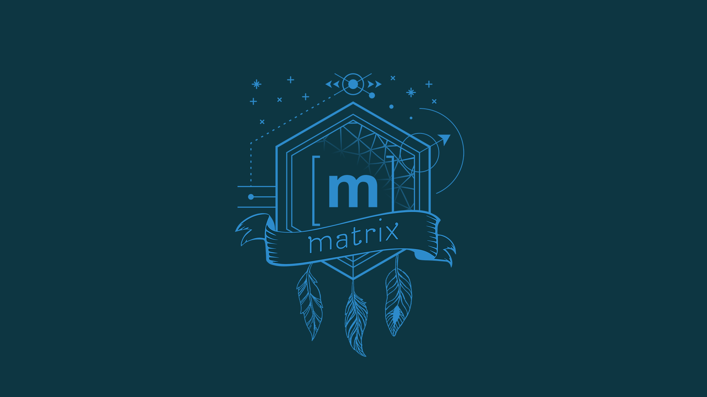

# This Week in Matrix 2019-03-22

## Matrix Live with Kitsune

I chatted with [Kitsune], maintainer of [libQMatrixClient], [Quaternion] and Spec Core Team member. We talked about the history and future of these projects, platform preferences, the importance of decentralisation and more.

<iframe width="560" height="315" src="https://www.youtube.com/embed/h9uenfVToaw" frameborder="0" allow="accelerometer; autoplay; encrypted-media; gyroscope; picture-in-picture" allowfullscreen></iframe>

## Synapse and the road to 1.0

Neil, Synapse-dev wrangler #1:

> Huge thanks to everyone who has helped increase the number of ‘1.0 ready’ synapse installs. If you don’t know what this means, [see our blog](https://matrix.org/blog/2019/03/15/matrix-1-0-https-arewereadyyet-com/).  <https://arewereadyet.com> reports > 60% adoption on a per server basis, and high 90s on a per user basis. We are now really close to being able to ship a 1.0 release candidate and start the 2 week countdown before releasing 1.0 proper.

> This week we have focussed on performance, richvdh has been working on batching of outgoing read receipts and hawkowl shipped a much more performant implementation of user search. Erik has been putting the [state compressor](https://github.com/matrix-org/rust-synapse-compress-state) through its paces, he saw one room compress down to 1% of its original size. Andrew has been focusing on ensuring spec compliance on various Synapse endpoints and is currently looking at some bugs in the federation tester.

## NixOS-Synapse setup

[Jonas Schürmann] shared his config for Synapse on NixOS:

> I open sourced my NixOS-Synapse setup: <https://gitlab.com/MazeChaZer/nixops-servers/tree/master/matrix>

[#NixOS:matrix.org] for more.

## Pattle, lots of progress and Dart SDK planned

Lots of news from [Pattle], the project aiming to create clients for multiple mobile platforms. All quotes below from [Wilko].

Pattle for Android [now has an F-droid repository](http://fdroid.pattle.im/)

> It's the most up to date version straight from the pipeline, so not necessarily stable.

> You can now scroll up and load history

As part of the project, [Wilko] also announced the intention to create a Dart SDK:

> I'm currently working on a [Matrix SDK for Dart](https://git.pattle.im/pattle/library/matrix-dart-sdk), which will be used for the [Pattle rewrite in Flutter](https://git.pattle.im/pattle/app).  
> The reason for this is outlined [here](https://git.pattle.im/pattle/android#future). To summarize: My goal for Pattle is to release for not only Android but also iOS and web, with a single code base. Other reasons include that Android native development is just bad, and the fact that I'm not too happy with the official Matrix Android SDK design and documentation.  
> I will maintain and also add some features to the current version of Pattle, to try things out. The Flutter version will replace the native one once the features are in sync.

## Riot iOS

> We've released an hotfix release 0.8.4 on App Store that fixes following issues:
>
> * Unable to open a file attachment of a room message.
> * Unable to share a file with whitespace in filename.
>
> We are working on iOS 12 notifications features.

## Riot Android

> * Improving new notification system
> * Implementing SAS verification

## RiotX (Android)

> * Setup CI
> * Finishing Phase 0

## Dimension sticker packs

[TravisR] has introduced sticker packs for [Dimension]:

> Dimension now has beta support for custom sticker packs.
>
> To create a sticker pack:
>
> 1. Start a conversation with @stickers:t2bot.io
> 2. Say `!stickers newpack` and follow the prompts.
> 3. Share the URL with your friends.
>
> To add the sticker pack to your sticker picker:
>
> 1. Make sure you're using Dimension as your integration manager.
>   * Not sure if you are? Click the 4 squares in the top right of the room in Riot - if the dialog is titled "Dimension", you're all set :)
>   * If you aren't, check out https://dimension.t2bot.io
> 2. Click on the smiley face to the right of where you type messages then the Edit button in the top right.
> 3. Paste the URL of the sticker pack into the box and click "Add Stickerpack".
> 4. Start using your new stickers.
>
> These instructions are also available at <https://github.com/turt2live/matrix-dimension/blob/master/docs/custom_stickerpacks.md> as is the admin/operator guide for running your own sticker bot (you're not stuck with using t2bot.io unless you want to be).
>
> Custom sticker packs are still beta while the proposals to share this with the wider Matrix ecosystem are still works in progress. This serves as a proof of concept to see how crazy of an idea it is to have stickerpacks-as-rooms (yes, they're just plain Matrix rooms under the hood) and what needs ironing out before moving ahead with the MSC.

## matrix-notification-profile-manager

[Brendan] has created a notification profile manager:

> Over the past few weeks, I grew a bit fed up of always having to turn on and off every notification rule each time I'm having a slight change in what I'm working on or depending on what mood I was in (e.g. want to focus only on work-related stuff and nothing else, don't want to hear about work at all, somewhere in the middle, etc.), so I built a [notification profile manager for Matrix](https://github.com/babolivier/matrix-notification-profile-manager). It's available both as a command line interface or a Go package in case people want to build on top of it.
>
> It allows one to take a snapshot of their current notifications settings and save that as a profile, so that this profile can be applied later. It also allows one to delete a profile or list the existing profiles (more features to be added as time goes by). In order to make the whole thing interoperable with other projects building on top of the Go package, it also uses the user's account data on the user's Matrix homeserver to store profiles.

## neo v4: iris

[F0x] has recommenced development on his Matrix client Neo:

> After discussion following <https://cyberia.social/@foks/101785513826000032> I've resumed development on Neo. Suggestions are very much welcomed on the pad and mastodon thread  
> I'm implementing components one by one now, with just mocked events. Actual Matrix integration will come when the gui components are ready.

> Neo is now partly integrated with `matrix-js-sdk` because I grew tired of having to write my own mock events. There's a basic authentication flow, with 0 error handling, and parsing of `m.text` and `m.image` events

Check out <https://git.lain.haus/f0x/iris> for the source code and see a working version at <https://neo.lain.haus/neo>

fox also said:

> it would be much appreciated to get some feedback on how I implemented matrix-js-sdk, had to do some weird stuff to make React update

I'll take a look but would love anyone with more experience of the SDK to get in touch with the f-man.

## solari[z|s]ed wallpaper

[ma1uta] provided this awesome Matrix wallpaper, created via <https://linux.pictures/projects/solarized-dark-wallpaper>

## mautrix-telegram 0.5.0 released

[tulir] is up again with his Telegram bridge:

> [mautrix-telegram] 0.5.0 was released after I finally fixed the bug that was causing the bridge database to lock up. It turned out to be a single line of ORM usage that I had missed while converting everything to use SQLAlchemy Core.  
> The full release notes are at <https://github.com/tulir/mautrix-telegram/releases/tag/v0.5.0.>  
> I also released [v0.5.1](https://github.com/tulir/mautrix-telegram/releases/tag/v0.5.1) to fix a bug that made the DBMS migration script not work and Python 3.5 compatibility. I wouldn't recommend using Python 3.5 though, I'm going to drop support for it some time after Debian 10 is released

## Shevski mentions Matrix on BBC Radio 4

Shevski from the #[redecentralize] organisation was interviewed on Radio 4, and mentioned Matrix:

<blockquote class="twitter-tweet" data-lang="en">
Yesterday on <a href="https://twitter.com/BBCRadio4?ref_src=twsrc%5Etfw">@BBCRadio4</a> I talked about the problems of centralisation, how to regulate big tech, personal data stores and <a href="https://twitter.com/redecentralize?ref_src=twsrc%5Etfw">@redecentralize</a>! You can listen online here: <a href="https://t.co/xGHK812lYa">https://t.co/xGHK812lYa</a> with <a href="https://twitter.com/hashtag/Web30?src=hash&amp;ref_src=twsrc%5Etfw">#Web30</a> section starting 1:50 mins in 😊 (I&#39;m from 7mins ish) <a href="https://twitter.com/hashtag/redecentralize?src=hash&amp;ref_src=twsrc%5Etfw">#redecentralize</a> <a href="https://t.co/m0dazBH7Dk">pic.twitter.com/m0dazBH7Dk</a>
&mdash; Irina (Ira) Bolychevsky (@shevski) <a href="https://twitter.com/shevski/status/1109056592396382208?ref_src=twsrc%5Etfw">March 22, 2019</a></blockquote>

## Extras

[Scylla] has been receiving regular updates, no release to report but the project keeps going. [#scylla:riot.danilafe.com]

This React Native client is not announced so [don't look at it](https://github.com/limvot/bubbles)

My pal Doug shared his frustration with the broader state of the chat ecosystem after [reading that teens now use Google Docs for their chat needs](https://www.theatlantic.com/technology/archive/2019/03/hottest-chat-app-teens-google-docs/584857/) (and not the chat feature, the document itself!)

> I love that you've got Amazon with their Alexa messaging, Apple in their own bubble with iMessage, Facebook doing chat 3-ways and Google trying 50 ways to do chat. And that’s before you even get into things like Slack, Discord, Telegram, Riot, Line, WeChat etc etc. And then the current hot way to chat is in a document... 
> I mean, **how much money is being invested into trying to create the perfect chat solution?**

For the record, we were chatting over Matrix...

## That's all I know

That's the news, if you have something to say, or something to add, then you should go to [#twim:matrix.org] and share it. If you have other projects to discuss, come share them. If you'd prefer to come quietly, my door is always open: [@benpa:matrix.org].

See you here next week, and on Matrix!