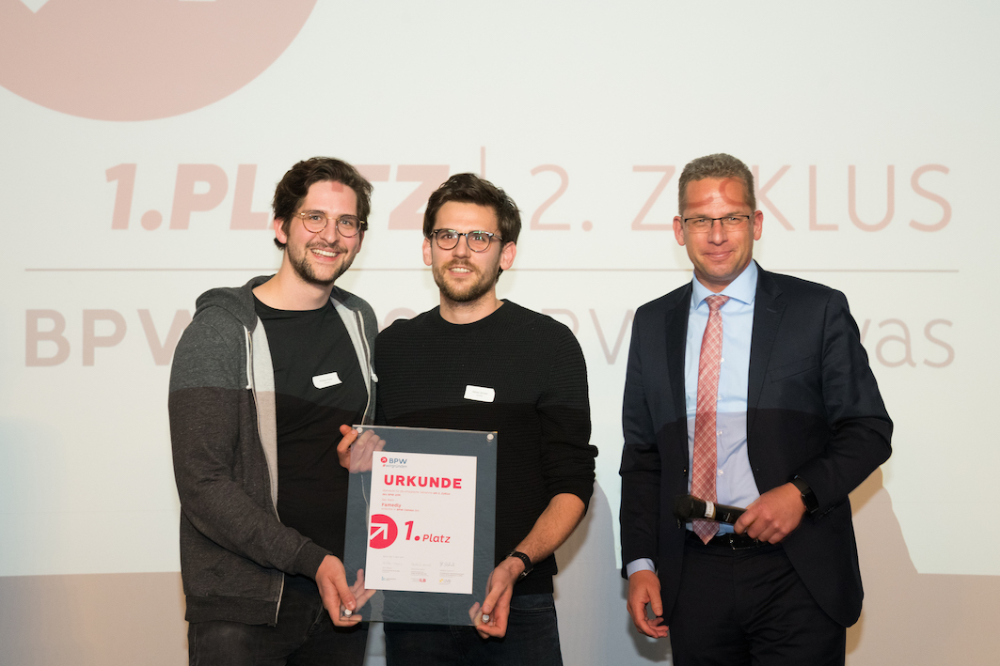
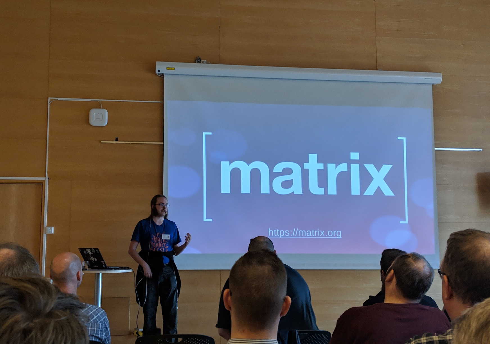

# This Week in Matrix 2019-04-12

 by <a href="https://matrix.org/blog/author/benp/" title="Posts by Ben Parsons" rel="author">Ben Parsons</a> | Apr 12, 2019 | <a href="https://matrix.org/blog/category/this-week-in-matrix/" rel="category tag">This Week in Matrix</a> | <a href="index.html#respond">0 comments</a>

## Matrix Live featuring Slavi, creator of [matrix-docker-ansible-deploy]

<iframe width="560" height="315" src="https://www.youtube.com/embed/ubD1QrNegIo" frameborder="0" allow="accelerometer; autoplay; encrypted-media; gyroscope; picture-in-picture" allowfullscreen></iframe>

This week, as you may have seen, [there was some downtime on matrix.org](https://matrix.org/blog/2019/04/11/security-incident/). With matrix.org being such a large homeserver, there was some disruption to the ecosystem, but Matrix was not "down", since so many people are running their own homeservers. In fact - many rooms were not heavily affected by the downtime.

If you'd like to run your own server, now is a great time to get started because of projects like [matrix-docker-ansible-deploy], which allow you to use Docker and Ansible to massively simplify installation and maintenance.

## Famedly, start-up with investment making use of Matrix

[jcgruenhage] shared this exciting news:

> Some of you might have heard that there's a Berlin startup called famedly (see <https://famedly.com> if you can read German), that employed some people from the German matrix community (including MTRNord from SimpleMatrix, krille from Fluffychat and myself), working on getting matrix into the German health sector. We won startup competition yesterday, giving us more funding for continuing our work on matrix and connecting to potential users and investors.

> Our main work right now is writing a matrix client focussed on simplicity and the specific needs of the health sector and building the surrounding infrastructure. On the client side we look forward to working with the two other Dart/Flutter clients, to reduce duplicated work on the SDK side.

> For questions and general chat, please join [#famedly:famedly.de]  Code will follow later once we have more to show off. Contributions to existing codebases will be licensed under their license, new stuff that we write will be (A)GPLv3.

> The two people on the left are [larodar](https://matrix.to/#/@larodar:famedly.de) and [phill.short](https://matrix.to/#/@phill.short:matrix.org), the two doctors who originally came up with the concept after being very dissatisfied with the existing comms solutions in that sector.  
> The one on the right is one of the people organizing the competition from a German bank.

## Synapse

> * More progress against server key validity periods
> * MSC1711 (ensure valid S2S CA certs) support ready for final review
> * Started work on reactions
> * Started work on optimising small homeserver instances

## Construct update

> [Construct] made lots of progress this week toward the 1.0 release. One highlight of interest is the new experimental approach to initial sync called phased initial sync or "crazy loading" for short. Construct sends a very small amount of data to the client at first so it loads very quickly. It then feeds a sequence of since tokens which act to update the client live with small chunks until the initial sync is complete. This allows client developers to build a progress meter for initial sync.  
> This is just one of the many innovations for performance to enhance your user experience that we love building here. We need your support and contributions at <https://github.com/matrix-construct/construct> and in [#test:zemos.net]

## Introducing bluepill, a new client for Sailfish OS

If you're using Sailfish, you might be interested in this very [early announcement](https://talk.maemo.org/showpost.php?p=1556056&postcount=72 ) from [Cy8aer] about [bluepill], a new Matrix Client for Sailfish written in Python.

> hi benpa it is getting into pre-alpha state and let the community on it. It is far away from release but now I cannot cancel it anymore

YOU CANNOT CANCEL IT ANYMORE

If you're not using Sailfish on a device and want to try bluepill, Cy8aer has you covered:

> you can already test it with the sdk emulator https://sailfishos.org/wiki/ApplicationDevelopment#Gettingstarted and the Readme from the repo

## Ananace at foss-north 2019

[Ananace] has been at [foss-north 2019](https://foss-north.se/2019/), sharing the love and knowledge about Matrix:

> I've now held a lightning talk about Matrix at FOSS-North, and am discussing with the Gothenburg FOSS community about setting up a homeserver for them

## Major gomuks update

[tulir] has been storming work on [gomuks], his Go CLI client this week:

> While waiting for [metaolm] to be functional, I've been developing gomuks again for the past couple of weeks. So far the changes are mostly internal, but there were a few visible changes too.
> 
> * Switched to my own TUI component library. The main visible change from this is that the input bar now supports multiline input. Sadly most terminals don't send ctrl/shift modifiers for enter and alt+enter is being used by the quick room switcher, so the temporary-ish way to input newlines is ctrl+n.
> * Changed history storage to store raw event data instead of parsed data.
> * Improved HTML parser/renderer. The old parser parsed HTML into a string with style information, whereas the new parser parses it into my custom renderable structs. The new style should make it possible to add scrolling to code blocks and other such things in the future.
> * Added syntax highlighting support for code blocks.
> * Improved reply rendering. The old reply rendering just put some HTML into the new event before parsing. Now it actually renders the original event separately.
> * Added commands for inviting, kicking, banning, unbanning and sending raw events in the current room (thanks to [nepugia])

## Riot Web

> * Finishing touches to breadcrumbs
> * More redesign activity
> * Planning for Message Editing and Reactions

## Riot iOS

> * Grouped notifications have landed
> * Fix upgraded rooms that appeared twice in room
> * Interactive device verification is still in progress

## Riot Android

> * We have fixed several issue related to the integration of the last Jitsi  library.
> * SAS PRs are in review

## RiotX (Android)

> * It’s now possible to create a room
> * Send file to a room is now supported
> * Some slash commands are now supported: send emote, invite people to a room
> * Slash command and people completion is here, but there are still a few issue with it

## [yuforia] has continued work on [continuum]

> [continuum](https://github.com/koma-im/continuum-desktop) completely removed plaintext file-based storage; now working to complete database-based local storage

## [f0x] working on [neo]

> I did some bugfixes in the [Neo] login process, testing is welcomed. There's not much of a functional client after login yet, but there's full .well-known discovery :)

[See a working version of neo here](https://neo.lain.haus/neo).

## libaqueous

[Black Hat]:

> I implemented more strongly-typed event types in [libaqueous]. Also applied some performance tweaks in the sqlite store.  I am still stabilizing and documenting the API for now.  
> Dart's serialization framework is still a bit inconvenient to use, but the language's flexibility is great. Also fast prototyping!

## Still more

[Alexandre Franke] gave a talk last Sunday at [Journées Du Logiciel Libre](https://jdll.org/) in Lyon. He gave a tour of Matrix and encouraged attendees to switch to it. In future we'll link to a video of the talk and his blog of the event!

> The talk was recorded and I would have given a link, but they haven’t been published yet.

GSOC student applications ended on Tuesday - Matrix received some great entries and we're looking forward to welcoming them to the project this summer!

## That's all I know

If you have something to say here, something to add, come chat to us in [#twim:matrix.org] - I love that this is a supportive and engaged project ecosystem, so come share what you have!